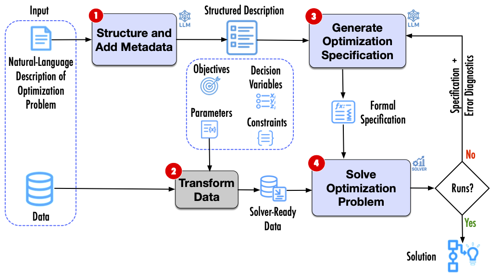

# EXEOS: EXtraction and Error-guided refinement of Optimization Specifications

EXEOS is an LLM-based approach designed to generate mathematical optimization specifications from natural language (NL) problem statements. It derives both AMPL models (a domain-specific language for optimization) and Python code (using Gurobi) from NL descriptions, iteratively refining them using solver feedback to improve executability and correctness. This project is based on the paper *"Models or Code? Evaluating the Quality of LLM-Generated Specifications: A Case Study in Optimization at Kinaxis"*, which evaluates the LLM-generated models in DSLs like AMPL and direct code in general-purpose languages like Python. The evaluation uses a public optimization dataset and real-world supply-chain cases from [Kinaxis](https://www.kinaxis.com), showing that AMPL is competitive with—and sometimes surpasses—Python in quality.

## Approach Overview
The EXEOS approach consists of four main stages, as outlined in Figure 4 of the paper:
1. **Structure and Add Metadata**: Identifies the main components of the optimization problem (objectives, parameters, variables, constraints) from the NL description, organizes them into a structured format, and extracts metadata (e.g., symbols, definitions, dimensions) for parameters and variables. The original description is rewritten with markup references to these symbols.
2. **Transform Data**: Processes user-supplied tabular data for parameter values, using metadata from Step 1, into a solver-ready format (AMPL-compatible .dat file or JSON for Python).
3. **Generate Formal Specification**: Transforms the structured description from Step 1 into a formal optimization specification using an LLM. This step handles initial generation (with prompts including syntax rules, few-shot examples, and the structured output) or refinement (extending prompts with prior specifications and solver feedback if errors occur).
4. **Solve the Optimization Problem**: Uses an optimization solver (e.g., Gurobi) with the specification from Step 3 and data file from Step 2 to compute a solution. If compilation or runtime errors arise, initiates a refinement loop back to Step 3 until solved or an iteration limit is reached.
   

## Project Structure

- **supplementary**: Contains prompt outlines and results PDFs.
  - `Prompt outlines`: complements SECTION 4 – OUR APPROACH of the paper.
  - `Results`: complements RESULTS in SECTION 5 of the paper.
- **data**: Public dataset with 60 NL optimization problems from textbooks.
  - `description.txt`: NL problem description with embedded data references.
  - `description2.txt`: NL problem description without explicit data (our approach).
  - Data files in JSON format (`data.json`) and AMPL format (`ampl-data.txt`).
- **code**: Core implementation files.
  - `app.py`: Main pipeline orchestrator (NL → Structured → AMPL/Python → Solve).
  - `batch_runner.py`: Runs all problems under `./data` multiple times and writes summary CSVs.
  - `nl_to_structured.py`: Handles NL to structured JSON extraction.
  - `data_transfer.py`: Normalizes `data.json` and generates `data.dat`.
  - `ampl_generator.py`: Generates and refines AMPL models.
  - `python_generator.py`: Generates and refines Python (Gurobi) code.
  - `llm_utils.py`: LLM routing and optional logprob capture.
- **results**: Outcomes of the experiments. Eight variant Excel files report relative error, number of compilation errors (#CE), and number of runtime errors (#RE).

## Prerequisites
- Python 3.8+.
- [AMPL](https://ampl.com/): Requires a license (community edition available for small problems; full license for larger ones). Install via `amplpy`.
- [Gurobi](https://www.gurobi.com/): Requires a license (academic/free trials available). Install via `gurobipy`.
- LLM APIs: OpenAI (default) or Google Vertex AI (Gemini). Requires API keys.
- Dependencies listed in `requirements.txt`.

Note: Some tools like AMPL and Gurobi require licenses for full functionality. LLMs need API keys—configure them in `config.json` or via environment variables.

### Configuration notes
- `EXEOS_CONFIG_PATH` can point to a custom `config.json` path.
- `EXEOS_PROMPT_DIR` can point to a custom prompt directory (default: `prompt/`).

## Installation and Configuration

1. Clone the repository:
   
`git clone https://github.com/neayoughi/EXEOS.git`

`cd EXEOS`

3. Install dependencies: `pip install -r requirements.txt`
4. Configure APIs and Licenses:
- **OpenAI API Key**: Set `OPENAI_API_KEY` in your environment or update `config.json`.
- **Google Vertex AI (Optional)**: Set `project_id` and `location` in `config.json`.
- **AMPL License**: Obtain from [AMPL website](https://ampl.com/) and configure in your environment (e.g., via `AMPL_LICENSE` or community edition setup).
- **Gurobi License**: Obtain from [Gurobi website](https://www.gurobi.com/) and set `GRB_LICENSE_FILE` or use academic licensing.
  
## Running the Application and Usage

### Single problem run (`app.py`)
Run the pipeline via `app.py` to process an NL optimization problem. It generates structured output, AMPL/Python specifications, solves them, and refines on errors.

**Basic usage**
`python app.py --nl_file path/to/description.txt --data_file path/to/data.json path/to/ample_data.txt `
- If providing AMPL data, the app writes it to input/data.dat, the AMPL solver uses data.dat.

**CLI options**
- `--nl_file` or --nl: Path to .txt file with NL optimization description (file or raw string).
- `--data_file`: One or two files: JSON data. Second is AMPL .dat or .txt
- `--model` (default: "gpt-4-1106-preview"): LLM model (e.g., "gpt-4o", "o4-mini", "vertex-gemini-2.5-pro").
- `--structure`: Turn on the structuring step before generation. 
- `--refinement`: Enable iterative refinement on errors (default: disabled).
- `--max_refine` (default: 2): Max refinement attempts.

**Example**
`python app.py --nl_file description.txt --data_file data.json ampl_data.txt --structure --refinement --max_refine 3`

 Outputs are saved in `logs/run_<timestamp>/`:
 
 - `input/`: `description.txt`, `data.json`, `ampl_data.txt` and `data.dat`, `structured_description.json`, `data_transfer_report.json`.
 - `ampl/`: AMPL .mod, solver output, solution files.
 - `python/`: Generated Python file, stdout/stderr logs, parsed `solution.json`.
 - `pipeline_result.json`: Top-level summary.

### Batch experiments (`batch_runner.py`)
Run many problems under `./data` multiple times and collect results in:
- `logs/ampl_results.csv`
- `logs/python_results.csv`

**Example (full pipeline)**
`python batch_runner.py --data_root data --logs_root logs --runs 5 --model gpt-4o --structure --refinement --max_refine 2`

**Example (baseline without data transfer)**
`python batch_runner.py --data_root data --logs_root logs --runs 5 --model gpt-4o --no_transfer`

**Key flags**
- `--data_root` (default: `data`): Root folder with problem subfolders.
- `--logs_root` (default: `logs`): Output folder for logs and CSVs.
- `--runs` (default: 5): Runs per problem.
- `--model`: LLM model name.
- `--structure`: Run NL structuring per problem.
- `--refinement`: Turn on refinement loops in generators.
- `--max_refine`: Max refinement attempts.
- `--logprob`: Save token logprob data when supported.
- `--no_transfer`: Skip data transfer and keep original inputs as the baseline.
- `--only_ampl`: Run only the AMPL pipeline.
- `--only_python`: Run only the Python pipeline.
  
Batch run logs are written under:
`logs/<problem_id>/<run_index>/` with `input/`, `ampl/`, and `python/` subfolders.

